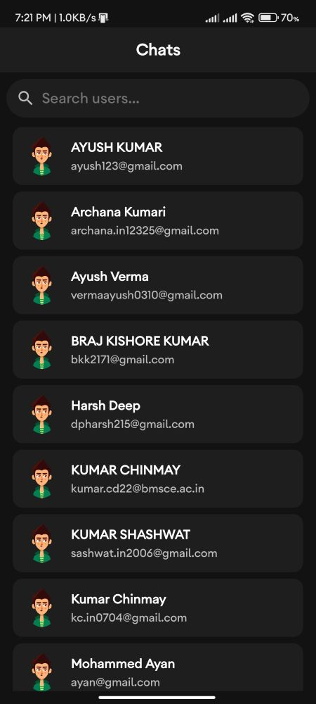

# BillBuddy

**Smart Expense Management & Bill Splitting for Android**

BillBuddy is a modern Android app that makes expense tracking, group bill splitting, and financial collaboration effortless. Built with Kotlin and Firebase, it features a beautiful UI, real-time sync, and integrated chat for seamless group management.

---

## Table of Contents

- [Features](#features)
- [App Interface Previews](#app-interface-previews)
- [Project Structure](#project-structure)
- [Tech Stack](#tech-stack)
- [What Makes BillBuddy Unique?](#what-makes-billbuddy-unique)
- [Getting Started](#getting-started)
- [Contributing](#contributing)
- [License](#license)
- [Contact](#contact)

---

## 🚀 Features

- **Secure Authentication:** Sign up and log in with email/password.
- **Expense Tracking:** Log, categorize, and review expenses with detailed history.
- **Smart Bill Splitting:**
  - Split bills equally or assign custom shares.
  - Add multiple participants, track settlements, and view split history.
- **Integrated Chat:** Discuss expenses and settlements directly in-app.
- **Financial Insights:**
  - Monthly summaries, category analysis, and budget tracking.
  - Visuals: Pie charts, progress bars, and more.
- **Budget Management:** Set category budgets and receive alerts.
- **Modern UI/UX:**
  - Material Design 3, light/dark themes, and Lottie animations.

---

## 🖼️ App Interface Previews

### Home Page
<p align="center"></p>
<p align="center"><em>Dashboard with recent expenses, balances, and quick actions.</em></p>

### Track Expense
<p align="center"></p>
<p align="center"><em>Log and categorize your expenses with ease.</em></p>

### Split Bill
<p align="center"></p>
<p align="center"><em>Split bills among friends, assign shares, and track settlements.</em></p>

### Chat
<p align="center"></p>
<p align="center"><em>Discuss expenses and coordinate with your group in real time.</em></p>

### User Profile
<p align="center"></p>
<p align="center"><em>Manage your profile, view stats, and customize preferences.</em></p>

---

## 📁 Project Structure

```
Bill_Buddy/
├── app/                  # Main Android app module
│   ├── src/              # Source code (activities, fragments, viewmodels, etc.)
│   ├── build.gradle      # App-level Gradle config
│   └── ...
├── Interfaces/           # App interface images and GIFs
├── build.gradle          # Project-level Gradle config
├── settings.gradle       # Gradle settings
├── README.md             # Project documentation
└── ...
```

---

## 🛠️ Tech Stack

- **Language:** Kotlin
- **Platform:** Android (Min SDK 24, Target SDK 34)
- **Architecture:** MVVM
- **Backend:**
  - Firebase Authentication
  - Firebase Realtime Database (expenses, splits, chats, budgets)
  - Firebase Cloud Storage (profile pictures)
- **UI:**
  - Android XML Layouts, Material Components
  - ViewBinding, RecyclerView, CardView
  - Glide (images), Lottie (animations)
- **Local Storage:** SharedPreferences
- **Communication:**
  - Firebase Realtime Database
  - Agora VideoUIKit & RTC SDK (video calls)
- **Build Tool:** Gradle
- **Other Libraries:** Gson

---

## ✨ What Makes BillBuddy Unique?

- **All-in-One Solution:** Combines expense tracking, bill splitting, and chat in a single app.
- **Real-Time Collaboration:** Instant sync of expenses, chats, and splits across all devices.
- **User-Centric Design:** Clean, modern UI with smooth animations and theme support.
- **Comprehensive Insights:** Visual charts, detailed logs, and budget tracking for financial clarity.
- **Privacy & Security:** User data is securely managed with Firebase.

---

## 📲 Getting Started

1. **Clone the repository:**
   ```sh
   git clone <repo-url>
   ```
2. **Open in Android Studio.**
3. **Configure Firebase:**
   - Add your `google-services.json` to `app/`.
   - Set up Firebase Authentication and Realtime Database in the Firebase Console.
4. **Build & Run the app.**

---

## 🤝 Contributing

Pull requests are welcome! For major changes, please open an issue first to discuss what you would like to change.

---

## 📜 License

This project is licensed under the MIT License. See the [LICENSE](LICENSE) file for details.

---

## 📧 Contact

For questions, suggestions, or support, please contact [your-email@example.com](mailto:your-email@example.com).

---

*BillBuddy – Making group finances simple, transparent, and fun!*
